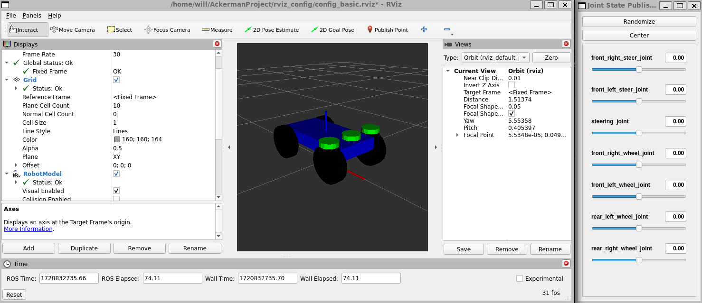
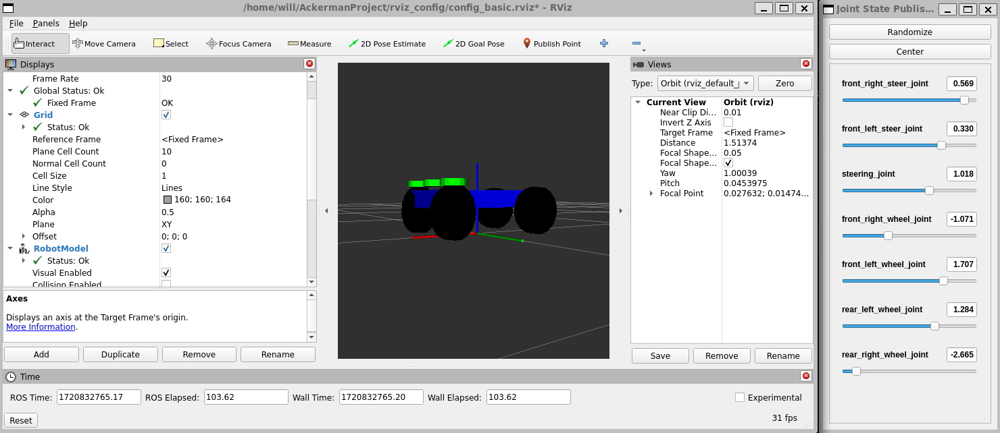
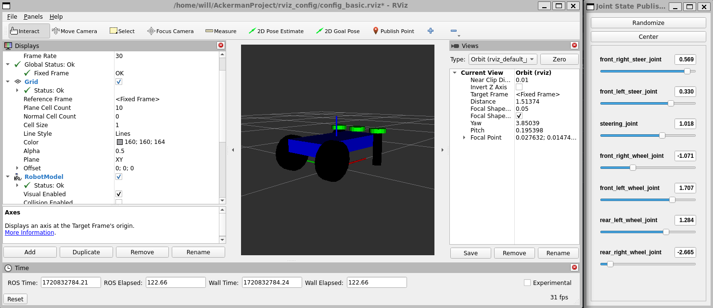
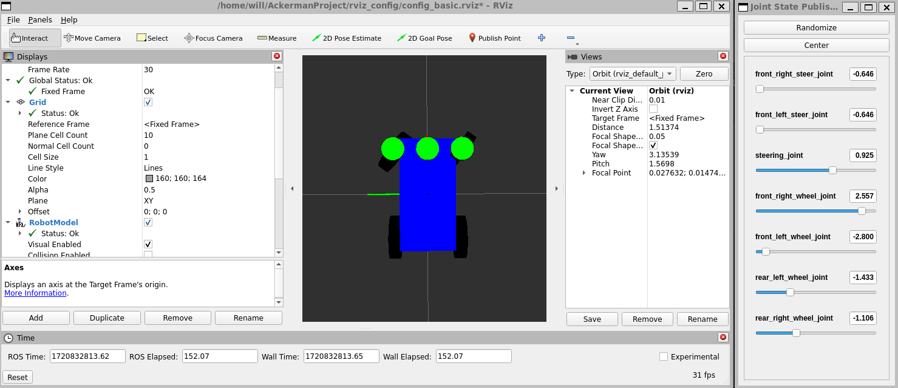

# Simulación y diseño de robot movil tipo Ackerman.

Requisitos para la ejecución del proyecto.

- Python.
- ROS2.
- RViz.
- Gazebo.

## Creación de modelo URDF.

El archivo URDF que modela el robot movil de tipo Ackerman se puede encontrar clickeando en el siguiente enlace [ackerman.urdf](https://github.com/Willica/Ackerman-ROS-Project/tree/master/urdf).

## Modularización con Xacro.

El archivo URDF generado se modularizo a modo de poder comprender el codigo que modela el robot de mejor forma. 

A continuación se mencionan los archivos modularizados con xacro y su finalidad.

- [ackerman_plus.xacro](https://github.com/Willica/Ackerman-ROS-Project/blob/master/xacro/ackerman_plus.xacro): Es el archivo principal que permite integrar elementos al robot.
- [ackerman.xacro](https://github.com/Willica/Ackerman-ROS-Project/blob/master/xacro/ackerman.xacro): Archivo que integra todas als partes para la correcta creación del robot tipo Ackerman.
- [base.xacro](https://github.com/Willica/Ackerman-ROS-Project/blob/master/xacro/base.xacro): Modularizacion de la base del robot.
- [steering.xacro](https://github.com/Willica/Ackerman-ROS-Project/blob/master/xacro/steering.xacro): Modularización de las direcciones del robot.
- [wheel.xacro](https://github.com/Willica/Ackerman-ROS-Project/blob/master/xacro/wheel.xacro): Modularización de las ruedas del robot.
- [params.xacro](https://github.com/Willica/Ackerman-ROS-Project/blob/master/xacro/params.xacro): Permite modificar aspectos relevantes del robot.
- [camera.xacro](https://github.com/Willica/Ackerman-ROS-Project/blob/master/xacro/camera.xacro): Modularización de la camara.
- [lidar.xacro](https://github.com/Willica/Ackerman-ROS-Project/blob/master/xacro/lidar.xacro): Modularización del sensor tipo lidar.

## Visualización en RViz.

La visualización en RViz se llevo a cabo mediante el siguiente archivo launch file [visualization_rviz.launch.py](https://github.com/Willica/Ackerman-ROS-Project/blob/master/ackerman/launch/visualization_rviz.launch.py) escrito en Python.

Para arrancar el arhivo de visualización se hizo uso de los siguientes comandos:

- cd /directorio_repositorio
- source install/setup.bash 
- ros2 launch ackerman visualization_rviz.launch.py

A continuación se muestra como se visualiza:

  <table>
    <tr>
      <td style="text-align: center;">
        
      </td>
      <td style="text-align: center;">
        
      </td>
    </tr>
    <tr>
      <td style="text-align: center;">
        
      </td>
      <td style="text-align: center;">
        
      </td>
    </tr>
  </table>

>NOTA: Se debe comentar la camara y el lidar en el archivo [ackerman_plus.xacro](https://github.com/Willica/Ackerman-ROS-Project/blob/master/xacro/ackerman_plus.xacro) para visualizarlo como se ve en la imagen.

La imagen mostrada a continuación muestra la comunicación entre los distintos nodos y topicos.

## Simulación en gazebo e integración de camara y lidar.

La visualización en Gazebo del robot movil tipo Ackerman se llevo a cabo mediante el siguiente launch file [visualization_gazebo.launch.py](https://github.com/Willica/Ackerman-ROS-Project/blob/master/ackerman/launch/visualization_gazebo.launch.py) escrito en Python. Por otro lado a su vez se integraron elementos al robot como la [camera.xacro](https://github.com/Willica/Ackerman-ROS-Project/blob/master/xacro/camera.xacro) y el sensor [lidar.xacro](https://github.com/Willica/Ackerman-ROS-Project/blob/master/xacro/lidar.xacro).

Para arrancar el arhivo de visualización se hizo uso de los siguientes comandos:

- cd /directorio_repositorio
- source install/setup.bash 
- ros2 launch ackerman visualization_gazebo.launch.py

Para operar el robot se debe hacer uso del siguiente comando:
- ros2 run teleop_twist_keyboard teleop_twist_keyboard

Al ejecutar el archivo de lanzamiento se ejecutara tanto Gazebo como RViz, el siguiente video [Ackerman Gazebo / RViz](https://www.youtube.com/watch?v=nsB6UI4z3HA) muestra el comportamiento del launch file.

La imagen mostrada a continuación muestra la comunicación entre los distintos nodos y topicos.

